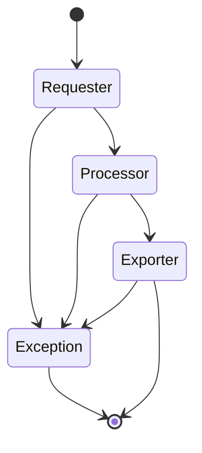

# anchor

::: warning 
STATEMENT: data is for personal use only!!!
:::

#### 0. Goal

Anchor some data in the web and automatically save periodically.

Currently running tasks:

- [x] [Tencent Careers](https://careers.tencent.com/jobopportunity.html)
- [x] [Baidu Careers](https://talent.baidu.com/jobs/social-list)
- [x] [ByteDance Careers](https://jobs.bytedance.com/experienced/position)
- [x] [Alibaba Careers](https://talent.alibaba.com/off-campus/position-list?lang=zh)
- [x] [JD Careers](https://zhaopin.jd.com/web/job/job_info_list/3)
- [x] [Bilibili Careers](https://jobs.bilibili.com/social/positions)
- [x] [Meituan Careers](https://zhaopin.jd.com/web/job/job_info_list/3)
- [x] [NetEase Careers](https://hr.163.com/job-list.html?workType=0)
- [x] [PDD Careers](https://careers.pinduoduo.com/jobs)
- [x] [360 Careers](http://hr.360.cn/hr/list)

#### 1. Why do this

Things are always changing, and I want to find a way to record this change easily.

A web crawler is a great tool to get data from web efficiently. So does [GitHub Action](https://docs.github.com/en/actions), which automate the process.

Solve real problems by combing existing tools is what *anchor* will do.

#### 2. Design concept

##### 2.1 Tools

- GitHub Action
- Python3

##### 2.2 Architecture

Inspired by [Scrapy](https://scrapy.org/).

The process is very simple.

- **DataItem**: user-defined data model
- **Requester**: issue a network request
- **Responser**: store information of response
- **Processor**: pure function to convert data from requester to *DataItem*
- **Exporter**: deal with *DataItem*, like saving to `.json` file or exporting to DB, etc.
- **Task**: a task scheduled by *Anchor Engine*
- **Anchor Engine**: asynchronous style task handler

#### Changelogs

##### 0.9.4 (2023-01-30)

###### Feature

1. add jd, bilibili, meituan, netease, pdd, 360 career task

##### 0.9.3 (2023-01-18)

###### Feature

1. add alibaba-career-task and byte-dance-career-task
2. add retry to GitHub Action

##### 0.9.2 (2023-01-17)

###### Feature

1. basic functions completed
2. add tencent-career-task and baidu-career-task

#### Reference:

1. https://scrapy.org/
